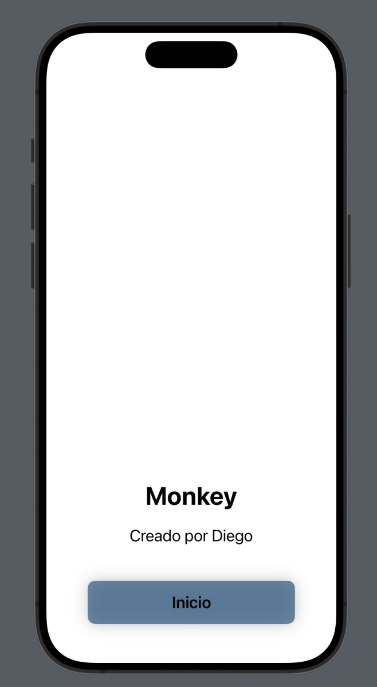

# Mi Aplicación Increíble

## Descripción
Esta aplicación demuestra cómo integrar una escena de Spline en SwiftUI y crear una pantalla de inicio moderna con un botón de efecto cristal. Es un excelente punto de partida para aprender SwiftUI y personalizar la apariencia de una aplicación.

## Objetivos de la clase
- Entender la estructura básica de una aplicación SwiftUI.
- Aprender a integrar una escena de Spline en SwiftUI.
- Crear y personalizar un botón con un efecto de cristal.
- Utilizar colores en formato hexadecimal en SwiftUI.

## Preparación del Proyecto

### Crear un nuevo proyecto en Xcode
1. Abrir Xcode y seleccionar "Create a new Xcode project".
2. Seleccionar "App" y hacer clic en "Next".
3. Nombrar el proyecto, seleccionar "SwiftUI" como interfaz y "Swift" como lenguaje, luego hacer clic en "Next" y "Create".

### Agregar Spline Runtime
1. Ir a `File > Add Packages...`.
2. Ingresar `https://github.com/spline-design/spline-runtime-swift` en el campo de búsqueda y agregar el paquete.

